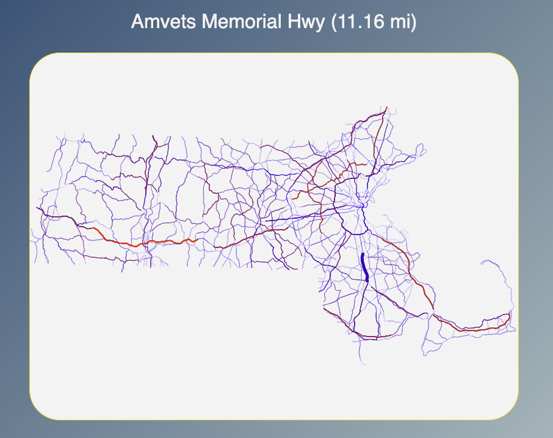
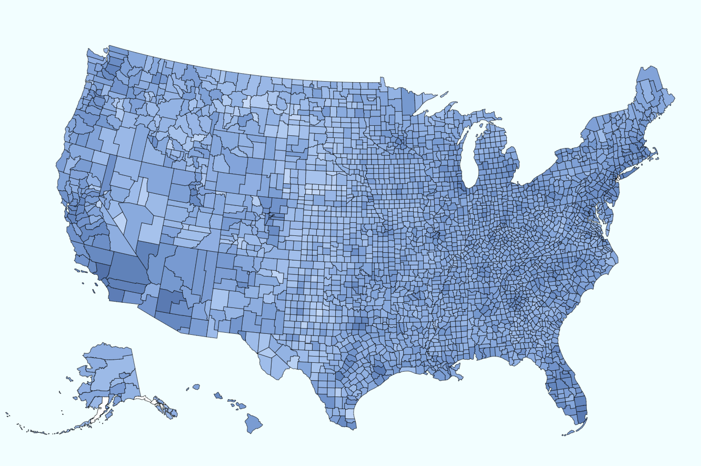
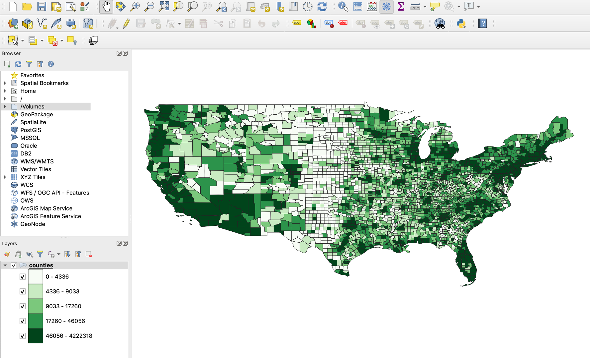
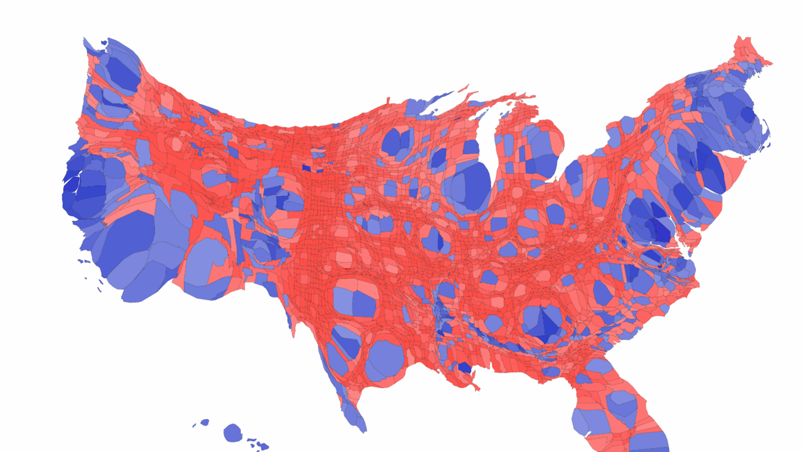

# Week 6: Geospatial Visualization

## Part 1 Examples

### 1.1 Line Visualization 

### 1.2 Loading topojson and geojson

### 1.3 Choropleth map

### 1.4 Loading topojson and geojson

## Cartogram Map

## Part 2: Cartogram

### 2.1 
### QGIS cartogram3 (cartogram plugin)

### D3JS Cartogram Map that can be customized

### 2.2 Transition between Choropleth and Cartogram

### 2.3 Pan and Zoom

### Part 3: DeckGL