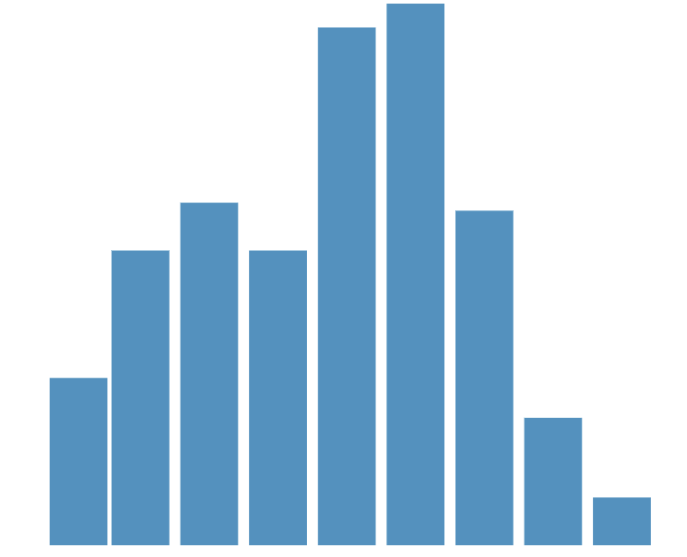

# Example 2
## Histogram Elements of a joint plot 
A joint plot is a form of multiview visualization which uses a plot of two variables with bivariate and univariate graphs. An example of jointplot can be found on [Seaborn's documentations](https://seaborn.pydata.org/generated/seaborn.jointplot.html).

In this example the horizontal and vertical bar charts for the joint plot are made and a function for each plot is defined.

