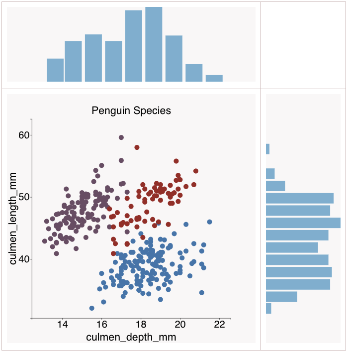

# Example 4
## Joint plot with Scatter Plot, and histogram

### Image result for jointplot
A Jointplot comprises three plots. Out of the three, one plot displays a bivariate graph which shows how the dependent variable(Y) varies with the independent variable(X). Another plot is placed horizontally at the top of the bivariate graph and it shows the distribution of the independent variable(X).
([Source](https://ajaytech.co/2020/09/28/8780/)).

