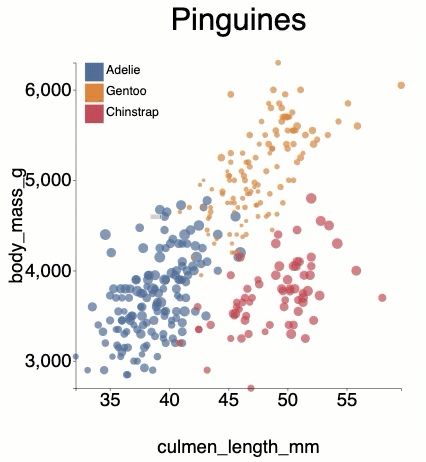

## Using d3.brush()
### The goal is to use brush to select specific marks from the visualization


### declare brush
d3.brush declares the brush event handler
the tho events, on "start", and on "brush" can be used to
identify the elements under the brush rectangle
- on start we will run "brushStart"
- on brush we will run "brushed" 
```
const brush = d3.brush()
        .on("start",  brushStart) // on start we will run "brushStart" 
        .on("brush", brushed)    // on brush we will run "brushed"
        .extent([
        [margin, margin],
        [1000-margin,1000-margin]
        ]);
```
### Call brush event handler
in this step we will initiate the brash handler on the DOM svg

```
// call brush event handler
   axis.call(brush);

```
### Apply style to the elements brushed when the brushed function runs

using .classed() function, we can enable or disable a class on the selected elements
- First get the coordinate of the brush rectangle
  let selected_coordinates = d3.brushSelection(this); // these are values on the screen
- The coordinates are viewBox coordinates, we will need to return them back 
to the actual values in the data, using scale.invert()         
e.g. let X1 = xScale.invert(selected_coordinates[0][0])
- Now we have the actual X1, X2, Y1 and Y2

 ```   
    // style brushed circles
    function brushed() {
        // use d3.brushSelection to get bounds of the brush
        let selected_coordinates = d3.brushSelection(this); // these are values on the screen

        // where is brushed?
        let X1 = xScale.invert(selected_coordinates[0][0])
        let X2 = xScale.invert(selected_coordinates[1][0])
        let Y1 = yScale.invert(selected_coordinates[0][1])
        let Y2 = yScale.invert(selected_coordinates[1][1])

```
- let us select elements that are between the brush area
```
        let selected_items = []
        d3.selectAll("circle").classed("selected", (d,i)=>
        {
            // data between the scaled brush coordinates
            if( +d[xCol] >= X1 &&
                +d[xCol] <= X2 &&
                +d[yCol] <= Y1 &&
                +d[yCol] >= Y2)
            {
                // store the id of the selected element for future use
                selected_items.push(`id_${i}`)
                // set the class to true in case the circle is between the values
                return true
            }
            else{
                // otherwise set the class to false
                return false
            }
        })
        console.log(selected_items)
    }
```

```
    function brushStart() {
        // if no selection already exists, remove the class
        if (d3.brushSelection(this)[0][0] == d3.brushSelection(this)[1][0]) {
            d3.selectAll(".markers").classed("selected",false)
        }
    }
```

