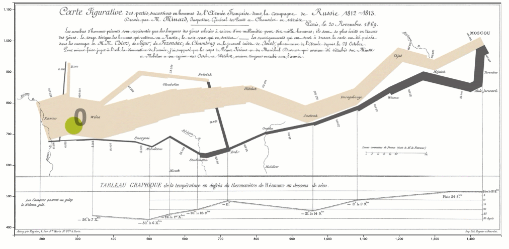

# Week - 14
## ScanPath of Eye Movements

Scanpath is a spatial node-link visualization that 
demonstrates the points of Fixation with nodes, and the size and color of the node
can represent multiple features such as dwell time (duration of eye fixation at one point)
pupil dilation, and number of micro-saccades during the fixation.
In the scanpath visualization the links represents the 
saccade length and position. Saccades are tha fast movement of the eye 
from one fixation point to another. 

In the eye tracking data analysis, the speed and acceleration of the saccades are also
estimated, and can be represented using the thickness of the links, color, or style of the line.

Scanpaths are almost always superimposed on the stimuli of the eye tracking experiment.

The steps used to make scanpath using d3js are as below:
### Step 1: 

Setting the environment, size of the stimuli plays an important role in this step
```
    // Stimuli dimensions
    const width = 1683;
    const height = 805;
```
Conventional SVG element implementation
```
    // add svg to the page
    const svg = d3.select('#svg_main').attr('viewBox', [0,0,width,height])
    // calculate 5% margin for the screen
    const marginX = parseInt(5*width/100)
    const marginY = parseInt(5*height/100)
```
Loading the eye tracking data, recorded during eye tracking experiment
```
    // load the data file
    d3.csv('../data/fixations.csv',
    d=>{
        // my time formatting method
        //d3.timeParse("%Y-%m-%d %H:%M:%S.%L")( "2020-11-29 13:33:06.524")
        return {
            time : d3.timeParse("%Y-%m-%d %H:%M:%S.%L")(d.time),
            duration : +d.duration,
            x: +d.x,
            y: +d.y,
            pupil_diameter : +d.pupil_diameter
        }
    }).then(main);
```
### Step 2
Define main function
```
function main(data)
{
// add a group holder to the svg element ---- transform it the margins
const figure =  svg.append('g')
.attr("class","figure")
.attr('transform',`translate(${marginX},${marginY})`);
const Stimuli = figure.append('g')


    const ScanePaths = figure.append('g')
            .attr("class","saccades")
    const fixations = figure.append('g')
        .attr('class','fixations')
        
``` 
### Step 3 
Loading the background image, which is the stimuli for the experiment
    
```
Stimuli.append("image")
            .attr("width",  width-2*marginX + "px")
            .attr("height", height-2*marginY + "px")
            .attr("xlink:href", "../data/stimuli.png");
```
### Step 4

Calculate the xScale, yScale and the rScale functions

```

const xScale = d3.scaleLinear()
                .domain(d3.extent(data,d=>d.x))
                .range([0,width-2*marginX]);

const yScale = d3.scaleLinear()
                .domain(d3.extent(data,d=>d.y))
                .range([height-2*marginY,0]);
// duration of the fixation
const rScale = d3.scaleSqrt()
                .domain(d3.extent(data,d=>d.duration))
                .range([3,30]);
// pupil diameter                
const pupil_colorScale = d3.scaleLinear()
        .domain(d3.extent(data,d=>d.pupil_diameter))
        .range(['#005500','#ffee00','#ff0000'])
        .interpolate(d3.interpolateRgb);               
```

Adding x and y axis is not necessary however, it is added as an option
```
    // append xAxis and yAxis to the added
    let xAxis = d3.axisBottom(xScale);
    let yAxis = d3.axisLeft(yScale);
    fixations.append('g').attr('transform',`translate(${0},${height-2*marginY})`).call(xAxis)
    fixations.append('g').call(yAxis);
    // append saccade lines
```    
### Step 5
Biding data for the saccades, and adding the scan paths
```
    ScanePaths.selectAll('.lines')
        .data(data)
        .enter()
        .append('line')
        .attr('x1',function(d,i) {
            if (i < data.length-1) {return xScale(d['x'])}})
        .attr('y1',function(d,i) {
            if (i < data.length-1) {return yScale(d['y']);}})
        .attr('x2',function(d,i) {
            if (i < data.length-1) {return xScale(d['x'])}})
        .attr('y2',function(d,i) {
            if (i < data.length-1) {return yScale(d['y'])}})
        .transition()
        .delay(function (d,i) {return i*500}) // delays are added to synch the animation
        .attr('x2',function(d,i) {
            if (i < data.length-1) {return xScale(data[i+1]['x'])}})
        .attr('y2',function(d,i) {
            if (i < data.length-1) {return yScale(data[i+1]['y'])}});
```
### Step 5
Biding data for fixations, and translate them to the right position
```
const fixation_points = fixations.selectAll('.fixations')
                                 .data(data)
                                 .enter()
                                 .append('g')
                                 .attr('transform', 
                                 d=>"translate("+xScale(d.x)+","+yScale(d.y)+")")
```
The fixation points should appear with the right amount of delay so that they are synchronized with the link elements 
```            
fixation_points.append('circle')
            .attr('r',0)
            .transition()
            .duration(500)
            .delay((_,i)=>(i-1)*500)      // delay is used to synch the animation with saccades
            .attr('r',d=>rScale(d.duration))
            .attr('fill',d=>pupil_colorScale(d.pupil_diameter))
            .attr('class','fixations');
```

```
fixation_points
            .append('text')
            .attr('class','label')
            .text((d,i)=>i.toString())
            .attr('opacity','0')
            .transition()
            .duration(500)
            .delay(function (d,i) {return (i-1)*500})
            .attr('opacity','.4')
```

   
