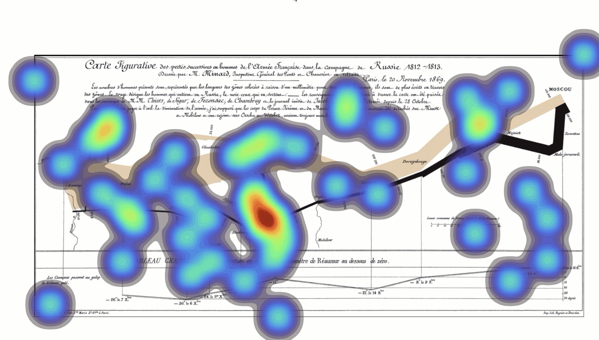

# Week - 14
## Heatmap of Fixations

One of the most commonly  used methods for identification of the duration of gaze on
one location on the stimuli during the eye tracking experiments is by the aid of the
heatmaps.


### Step 5. append the generated isolines to svg


## Step 1:
Set the Stimuli Image in the background

```
// image dimensions
const width = 1683;
const height = 805;
// calculate 2% margin for the screen
let marginX = parseInt(5*width/100);
let marginY = parseInt(5*height/100);
```
## Step 2. 
Add svg element to html file -- set and width and height

```
const svg = d3.select('#svg_main').attr('viewBox',[0,0,width,height]);
const figure = svg.append("g").attr('transform',`translate(${marginX},${marginY})`);
figure.append("image")
.attr("width",  width-2*marginX + "px")
.attr("height", height-2*marginY + "px")
.attr("xlink:href", "../data/stimuli.png");
```
## step 3
Load eye tracking data
```
const data_file ="../data/fixations.csv";
const bandwidth = 30; // bandwidth of the contours
d3.csv(data_file,function(d){
// my time formatting method
//d3.timeParse("%Y-%m-%d %H:%M:%S.%L")( "2020-11-29 13:33:06.524")
return {
time : d3.timeParse("%Y-%m-%d %H:%M:%S.%L")(d.time),
duration : +d.duration,
x: +d.x,
y: +d.y,
pupil_diameter : +d.pupil_diameter
}
}).then(main);

    function main(data){
```
        
## Step 4 
Heatmap Function

 ```       
    function heatmap(threshold){
            svg.selectAll('path').remove();
            const x_extent = d3.extent(data,d=>d.x);
            const y_extent = d3.extent(data,d=>d.y);
            const xScale = d3.scaleLinear()
                .domain(x_extent).range([ 0, width-2*marginX ]);
            const yScale = d3.scaleLinear()
                .domain(y_extent).range([ height-2*marginY, 0]);
            // compute the density data
``` 
###  Using d3.contourDensity() Convert Data into IsoContours

```
            const contourDensityData = d3.contourDensity()
                .x(function(d) { return xScale(d.x); })
                .y(function(d) { return yScale(d.y); })
                .size([width-2*marginX, height-2*marginY])
                .thresholds(threshold)
                .bandwidth(bandwidth)
                (data);
```             
### Color coding using d3.scaleSequential()

```
    const colorScale = d3.scaleSequential()
                .domain(
                    d3.extent(contourDensityData,d=>d.value)
                )
                .interpolator(d3.interpolateTurbo);
```
###  d3.geoPath() to convert contours into paths 

```
            figure.selectAll("path")
                .data(contourDensityData)
                .enter().append("path")
                .attr("d", d3.geoPath())
                .attr("stroke", "black")
                .attr("stroke-width", "1px")
                .attr("stroke-linejoin", "round")
                .attr('fill',function (d) {
                    return colorScale(d.value)});
        }
        
```

### run Heatmap for the firs time
```
  heatmap(threshold=20)
```
   
### Update it by the range slider
```
    document
        .querySelector('#range')
        .addEventListener('change',
            () => {
                heatmap(document.getElementById("range").value) }, false)
    }
```

