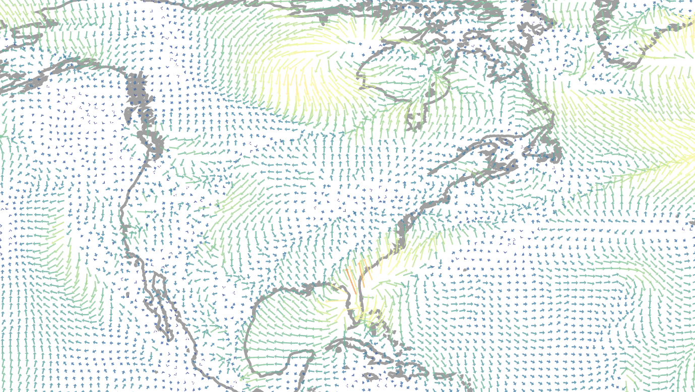

## Week 12
### Filed Flow Visualization with Glyphs
#### Glyphs are atomic visual elements that are used to represent one or more number of features of the dataset.

In these examples we will try to make a simple glyph which will
represent the speed and direction of the wind.
For this purpose, using d3js's path function a shape
which is similar to an arrow symbol is made.

The direction, scale, color and length of the glyph is set 
by a function. Using this function, we can append a 
glyph object to all or some of the cells of the data

