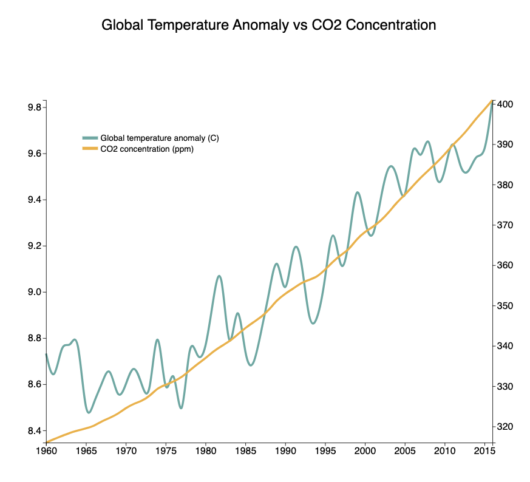

# Multiline Chart

In this exercise, you are required to create a line chart displaying CO2 PPM and temperature anomalies from 1959 to 2015. 

The basic preview of the visualization should resemble the figure below:

Make sure to style the visualization appropriately and include legends as well. Refer to myCourses for the detailed requirements.

Check myCourses for the points rubric.

The missing parts in the provided code are marked with comments, along with the points assigned for each part. 

Please ensure that the final code is submitted in the form of a complete project folder; otherwise, it will not run correctly, and resubmission will be required.
