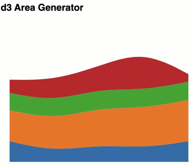

## d3.area generator + d3.stack

similar to the stacked bar chart, we can stack data using d3.stack.
In addition to the transformation of the data to stack, using d3.area,
we can generate area chart (path) using powerful d3.area generator.

In the example below, we will generate an area chart using the sample data.


<ol>

<li>
Sample data is like:

```
    const data = [
        {y01: 120, y02: 180, y03: 100, y04: 77},
        {y01: 60,  y02: 185, y03: 105, y04: 123},
        {y01: 100, y02: 215, y03: 110, y04: 131},
        {y01: 80,  y02: 230, y03: 105, y04: 231},
        {y01: 120, y02: 240, y03: 105, y04: 44}
    ];
```
</li>

<li>

Stack Generator:

```
    let stack = d3.stack()
        .keys(['y01', 'y02', 'y03','y04']);
    let stackedSeries = stack(data);
```
</li>
<li>
Using d3's categorical color Scheme

```
    const colors_Category10 = d3.schemeCategory10;
```

</li>

<li>
use scaleLinear to scale data to fit the size of the svg

```
    // find the max Y value
    const yMax = d3.max(stackedSeries.map(d=>d3.max(d.map(dd=>d3.max(dd)))))

    // find the min Y value
    const yMin = d3.min(stackedSeries.map(d=>d3.min(d.map(dd=>d3.min(dd)))))

    // Step 2: Scale function
    const yScale = d3.scaleLinear()
        .domain([yMin, yMax]) // data values are between [min , max] of stacked values
        .range([600, 100]);

```


</li>

<li>
Area generator to make d attribute for path

```
    const area = d3.area()
        .x((_, i)=> i * (800/stackedSeries.length))
        .y0(d=>yScale(d[0]))
        .y1(d=>yScale(d[1]))
        .curve(d3.curveBasis); // in case you want to have smooth lines!

```
</li>
<li> Append group to svg

```

   const group = d3.select('svg#main').append("g")

```
</li>
<li>
Bind data to the group children and append path to each child.

```
group.selectAll('.paths')
        .data(stackedSeries)        // bind data to the group
        .enter()
        .append('path')             // append "path" element to the group
        .attr('fill', (d, i)=>colors_Category10[i])
        .attr("opacity",0)
        .transition()           // add animation-transition
        .delay((_,i)=>i*1000)   // put delay between appearance of each element
        .duration(2000)         // add duration
        .attr("opacity",1)      // change opacity from 0 to 1 during 2 seconds
        .attr('d', d=>area(d));       // set the attr of "d" equal values of d
        //attr('d', area);       // in short it can be written as just the generator name

```


</li>
</ol>
