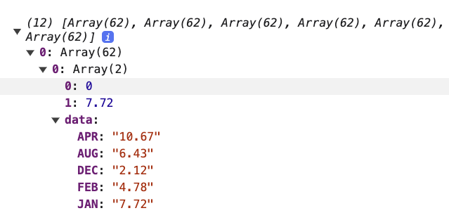

# Normal area chart

So the data is processed in the dataProcessing section:

```
YEAR,JAN,FEB,MAR,APR,MAY,JUN,JUL,AUG,SEP,OCT,NOV,DEC
1958,7.72,4.78,5.01,10.67,5.31,2.92,3.45,6.43,4.43,2.16,2.9,2.12
1959,2.24,3.89,8.24,3.83,1.77,6.02,5.44,2.02,1.15,5.16,5.1,3.91
1960,2.9,5.64,4.0,4.9,4.87,2.06,4.29,1.87,7.9,2.52,2.82,6.1
1961,2.94,3.33,4.62,5.43,5.65,1.34,2.04,3.73,6.58,4.08,4.01,3.81
....
```

Initially the data needs to be stacked:

```
    const stack = d3.stack() 
        .keys(['JAN','FEB','MAR','APR','MAY','JUN','JUL','AUG','SEP','OCT','NOV','DEC']);
    const stackedSeries = stack(data);
```

The stackedSeries now should look like:



After defining the xScale and yScale functions we can go ahead and use area generator

```
    const area = d3.area()
          .x((_, i)=> xScale(Years[i])) // the points for x values
          .y0(d=>yScale(d[0]))          // the lower bound of the area
          .y1(d=>yScale(d[1]))          // the upper bound of the area
          .curve(d3.curveBasis);        // in case you want to have smooth lines!
```

Finally, we add the area paths to the group
```
    group.append("g").attr("class","areaChart").selectAll('.paths')
       .data(stackedSeries)        // bind data we stacked earlier
       .enter()
       .append('path')             // append "path" element to the group
       .attr('fill', 
                (d, i)=>colors_Category10[i%10]) // categorical color scheme
       .attr("opacity",0)       //first set it to opac, so we can animate it
       .transition()           // add animation-transition
       .duration(100)         // add duration
       .attr("opacity",1)      // change opacity from 0 to 1
       .attr('d', area);       // in short it can be written as just the generator name
```


</li>
<li>