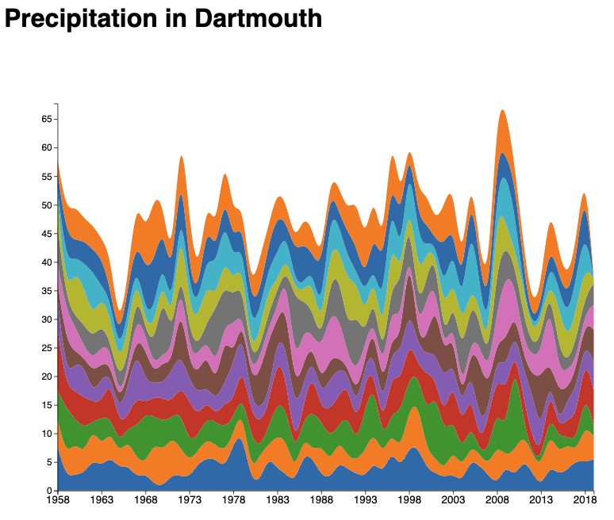

# Streamgraph


It is very simple to convert an area chart to a Streamgraph, you just have to modify the following line of code in area chart:

<ul>
<li>
Normal area chart

```
   const stack = d3.stack()
            .keys(months);
```


</li>
<li>

Streamgraph<b style="color:red">ed</b>: using <b>d3.stackOffsetWiggle</b>

```angular2html
   const stack = d3.stack()
            .keys(months).offset(d3.stackOffsetWiggle);
```


</li>
</ul>
