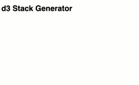
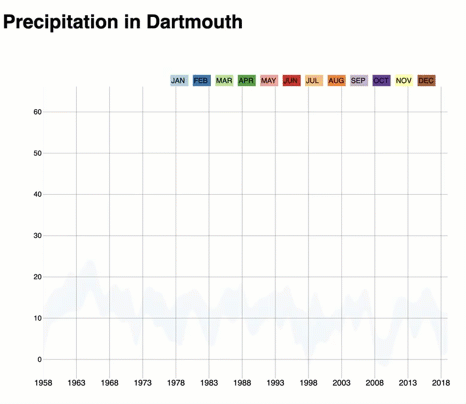

# D3 Generators

<h2>Generators:</h2>
- <a href="http://using-d3js.com/05_02_lines.html">d3.line()</a> & <a href="http://using-d3js.com/05_03_radial_lines.html">d3.lineRadial</a>
- <a href="http://using-d3js.com/05_05_areas.html">d3.area() & d3.areaRadial()</a>
- <a href="http://using-d3js.com/05_06_stacks.html">d3.stack()</a> & 

<a href="./Example%201/README.md"> See Example for the stacked bar chart</a>

 
<a href="./Example%202/README.md"> See Example for the Area chart</a>

 
<a href="./Example%205/README.md"> See Example for the Area chart</a>

