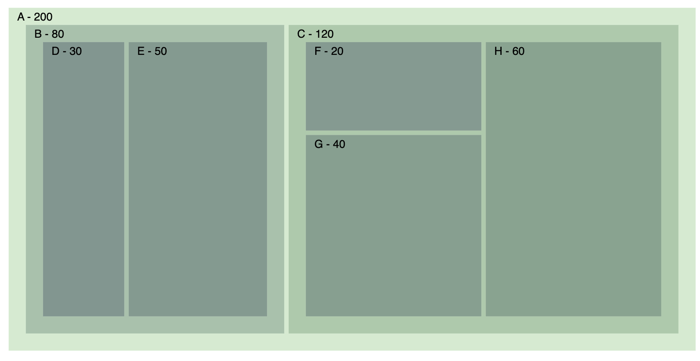
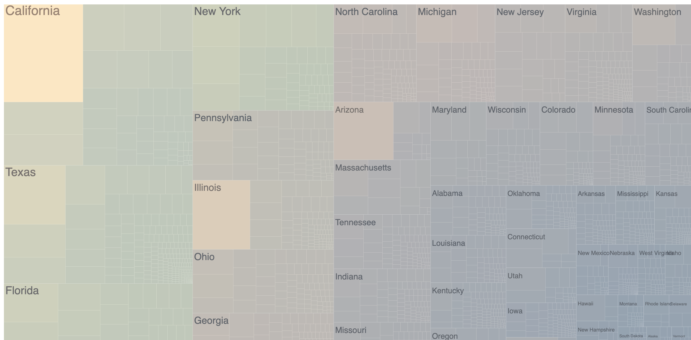
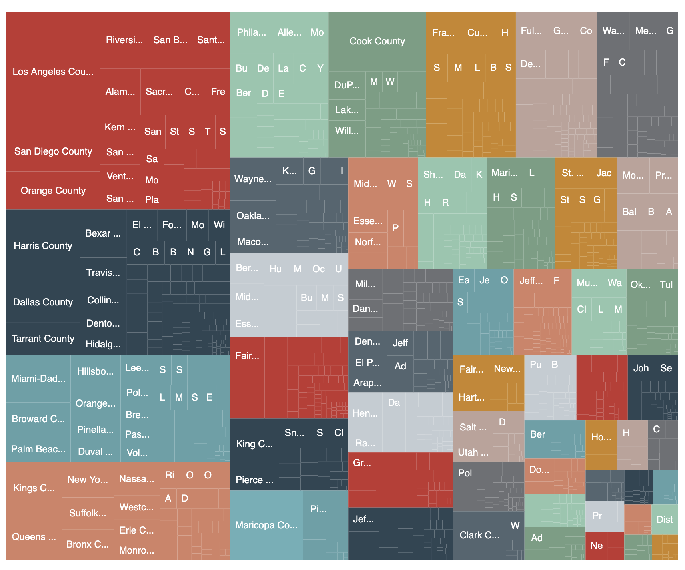
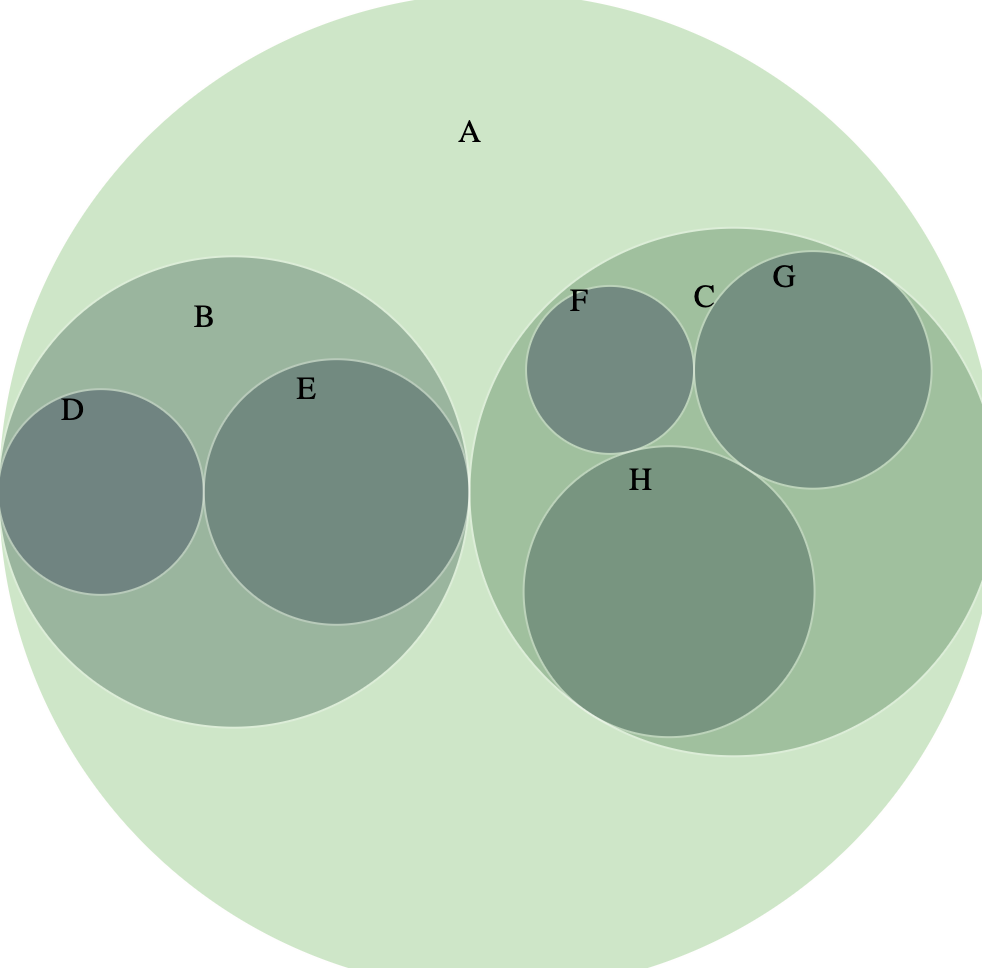
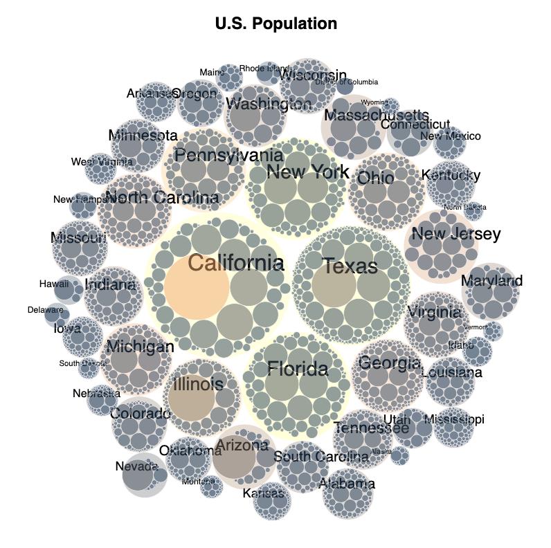

# TreeMap

## Using Stratify, Hierarchy, and Tree Layouts

**1. Example 1 - Adjacency Matrix**

**2. Example 2 - Simple Treemap**

**3. Example 3 - US Population Treemap**

**4. Example 4 - Using Echarts**

**5. Example 5 - D3 Circle Pack**

- Circle Pack
- Circle Pack adding labels

**6. Example 6 - D3 Circle Pack - U.S. Population**

