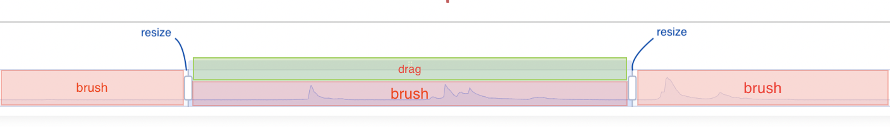

## Zoom Slider in Plots


Select the container element
```
const dom = document.querySelector('#container');// select container
```

Initialize the ECharts object
```
const scatter = echarts.init(dom);
```
ECharts option configuration begins here
```
scatter.setOption (
{...
```
Enable the x and y Axis
```
xAxis: {},
yAxis: {},
```

Add the dataZoom key to the options object

```
dataZoom: [
{
    type: 'slider',
    show: true,
    xAxisIndex: [0],
    start: 1, // Start point of Zoom slider
    end: 35 // End point of Zoom slider
}],
```

```
series: [
{
symbolSize: 20, // can be dynamically set with an accessor functio
data: [
        [10.0, 8.04],
        [8.07, 6.95],
        [13.0, 7.58],
        [9.05, 8.81],
        [11.0, 8.33],
        [14.0, 7.66],
        [13.4, 6.81],
        [10.0, 6.33],
        [14.0, 8.96],
        [12.5, 6.82],
        [9.15, 7.2],
        [11.5, 7.2],
        [3.03, 4.23],
        [12.2, 7.83],
        [2.02, 4.47],
        [1.05, 3.33],
        [4.05, 4.96],
        [6.03, 7.24],
        [12.0, 6.26],
        [12.0, 8.84],
        [7.08, 5.82],
        [5.02, 5.68]
    ],
type: 'scatter'
    }
    ]

... });
```