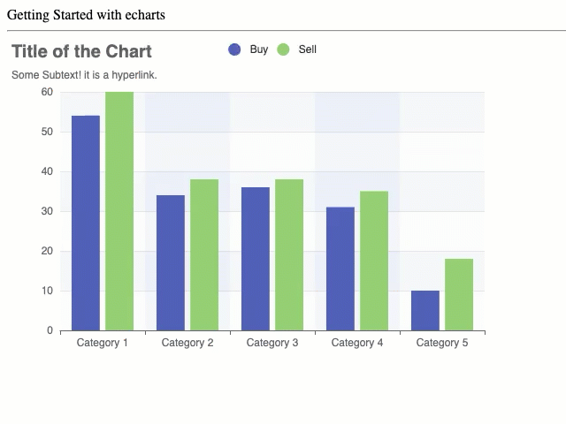
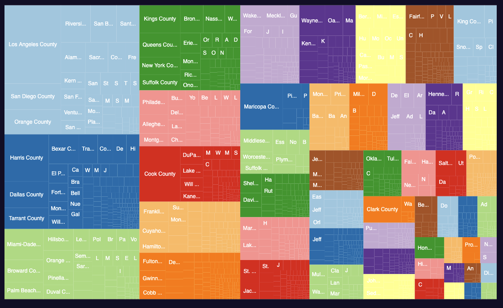
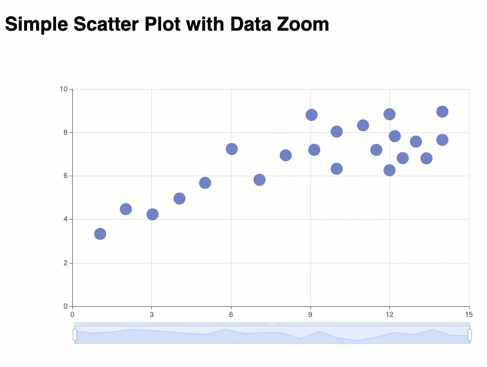
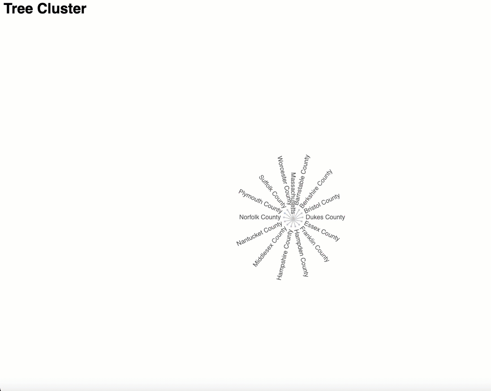
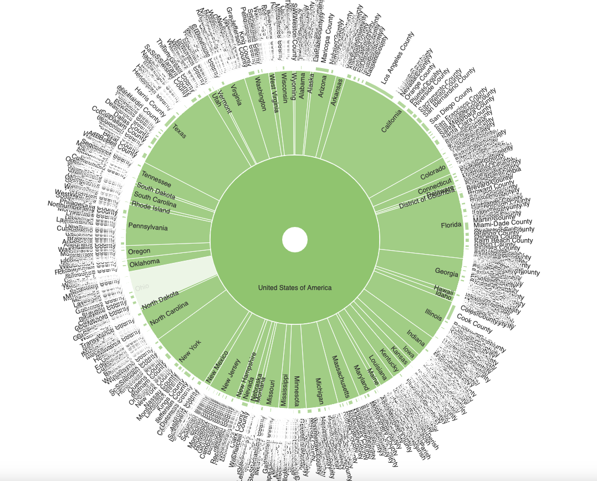

# eCharts Visualization Library Examples

The examples available in this repository demonstrate various ways to create visualizations using eCharts.

## Bar Chart 
In the [Bar Chart](https://github.com/umassdgithub/Week-9-part-2_echarts-Examples/tree/main/Example%201%20Simple%20bar%20chart) example the steps to make a simple bar chart are included.

## Tree Map

The [treemap](./Example%202%20Tree%20Map/) Example show how the nested data can be converted into a tree map.

## Scatter plot with Zoom Slider
One of the nice features of the eCharts library is the filtering option based on Zoom Slider. In [Example 3](./Example%203%20zoom%20slider) a simple zoom slider is added to the visualization.

## Cluster Tree
Using eCharts it is very easy to generate a Cluster tree, see [Example 4](./Example%204) for details.

## Sunburst Tree

In [Example 5](./Example%205%20sunburst) a sunburst visualization of the data used for the tree map visualization example is added. 

