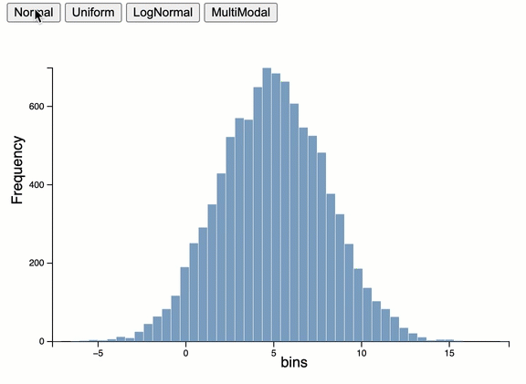
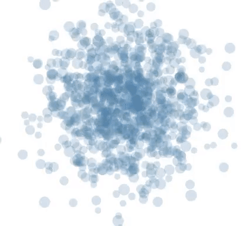
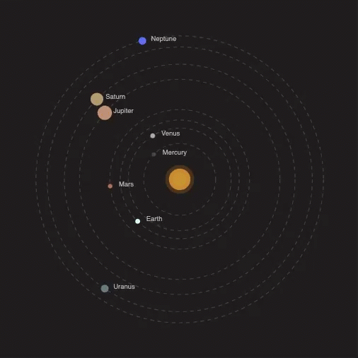

# Week-9 Interaction and Animation
 
D3 Animation/Transition + d3.interval(<i>function</i>,<i>timeSpan</i>);
<ul>
<li>Example 01 Transition</li>

<li>Example 02 Delay</li>
<li>Example 03 Update delay</li>
 
 
<li>Example 04 Chained transition using d3.active 
 
  
</li>
<li>Example 05 Animation using attrTween 

</li>
</ul>
